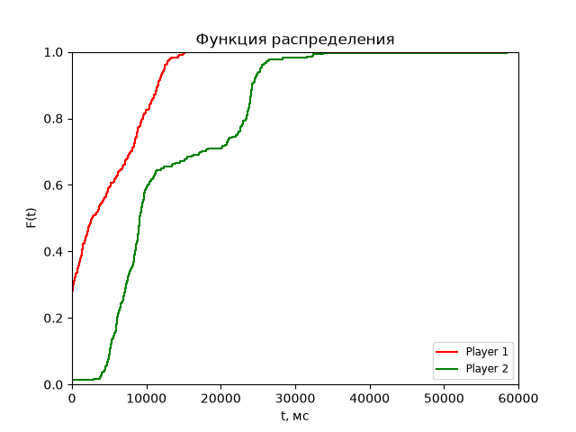

**Тестовое задание на вакансию Python-разработчика**

1. Критерии качества проигрывания видео

- Cреднее время задержки
- Cреднее время воспроизведения
- Процент задержки от общего времени
- Процент просмотра видео в высоком качестве
- Среднее количество переключений качества

2. Распределение плотности значений stalls_duration

   

3. Анализ замеров

Cреднее время задержки плеера 1: 4549 мс = 4 с
Cреднее время задержки плеера 2: 12847 мс = 12 с
Вывод: У плеера 1 среднее время задержки меньше, следовательно плеер 1 лучше.

Cреднее время воспроизведения плеера 1: 326506 мс = 326 с
Cреднее время воспроизведения плеера 2: 337311 мс = 337 с
Вывод: У плеера 2 среднее время воспроизведения больше, следовательно плеер 2 лучше.

Процент задержки плеера 1: 1%
Процент задержки плеера 2: 4%
Вывод: У плеера 1 процент задержки меньше, следовательно плеер 1 лучше.

Процент просмотра видео в высоком качестве плеера 1: 5%
Процент просмотра видео в высоком качестве плеера 2: 10%
Вывод: У плеера 2 процент просмотра видео в высоком качестве больше, следовательно плеер 2 лучше.

Среднее количество переключений качества плеера 1: 3
Среднее количество переключений качества плеера 2: 1
Вывод: У плеера 2 среднее количество переключений качества меньше, следовательно плеер 2 лучше.

Вывод: По результатам критериев плеер 2 лучше.
